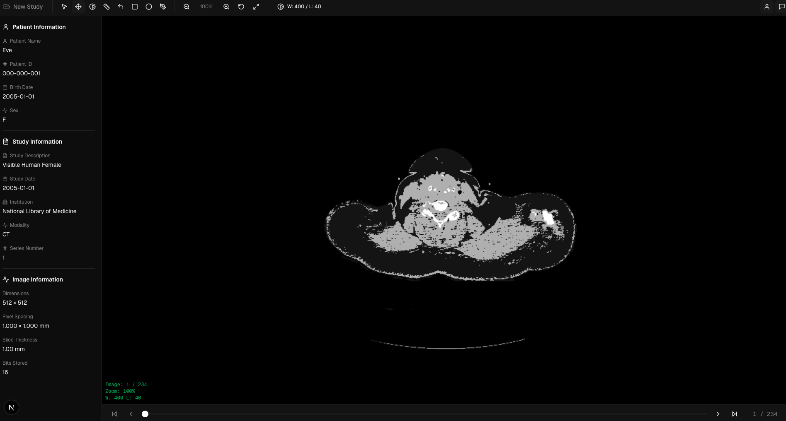

# DICOM Viewer

A web-based medical imaging viewer for DICOM files built with Next.js and TypeScript.



## Features

- Drag-and-drop DICOM file upload
- Image viewing with zoom and pan controls
- Window/Level adjustment for contrast and brightness
- Annotation tools: length, angle, rectangle, ellipse, and freehand drawing
- Patient and study metadata display
- Series navigation for multi-slice studies
- JPEG Lossless decompression support

## Tech Stack

- Next.js 16
- React 19
- TypeScript
- Tailwind CSS
- Radix UI

## Installation

```bash
npm install
```

## Usage

Start the development server:

```bash
npm run dev
```

Open [http://localhost:3000](http://localhost:3000) in your browser.

Build for production:

```bash
npm run build
npm start
```

## License

MIT
